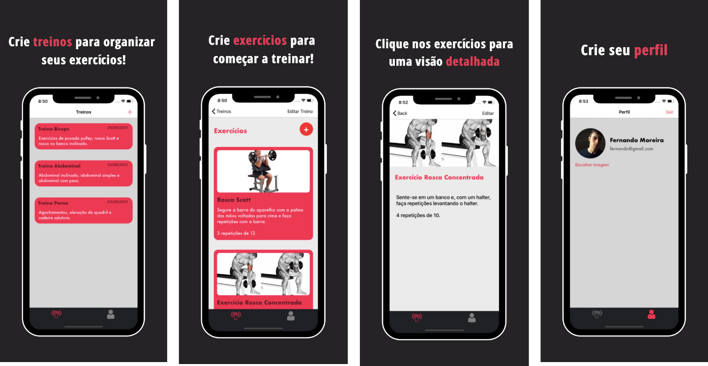

# Aplicativo GymApp

Aplicativo para gerenciar treinos e exercícios de musculação para iOS. Crie, edite ou remova treinos e, em cada treino, crie, edite ou remova exercícios para o seu treino do dia-a-dia. Crie seu perfil e comece a treinar!

 

 

## Features (Recursos)

- Criar, editar ou remover treinos;
- Criar, editar ou remover exercícios;
- Criar um perfil.

## Especificações

Este App foi criado com Swift, Firebase (Auth, Storage e Firestore) e CocoaPods. Para incluir imagens, foi incluído a biblioteca Image Picker.  

## Iniciando no App

Ao instalar o aplicativo GymApp, crie sua conta clicando no botão "Novo Usuário? Crie uma Conta.". Após criar, você será redirecionado para o App. 
    Primeiramente, sua tela de treinos estará vazia, mas você pode criar quantos treinos desejar para gerenciar seus exercícios de musculação do dia-a-dia (abaixo uma explicação de como criar).
        Em cada treino, você também pode criar quantos exercícios desejar, e vê-los em uma tela mais detalhada clicando em cima de cada um (abaixo uma explicação de como criar).

## Criando Treinos

Para criar um treino, basta ir na tela "Treinos" e clicar no botão "+" na parte superior. Uma tela irá aparecer, onde é possível atribuir um nome ao treino e uma descrição (opcional). Após terminar, clique no botão salvar.

## Vendo os Treinos Criados
Para ver os treinos que já foram criados, vá na tela "Treinos" e uma listagem ordenada pela data de criação com todos os treinos aparecerá.

## Deletando Treinos

Para deletar um treino, basta ir na tela "Treinos", arrastar o treino que você deseja remover para a esquerda e clicar no botão "delete".

## Editando Treinos

Para editar um treino, clique no treino que deseja e, na tela de exercícios, clique em "Editar Treino". Uma tela irá aparecer com os dados atuais do treino, possibilitando-o editá-lo. Após terminado, clique no botão salvar.

## Criando Exercícios

Para criar um exercício, basta ir na tela de exercícios e clicar no botão "+" na parte superior. Uma tela irá aparecer, onde é possível atribuir um nome ao exercício, uma imagem (opcional) e as observações sobre o exercícios (opcional). Após terminar, clique no botão salvar.

## Vendo os Exercícios Criados

Para ver os exercícios que já foram criados, vá na tela de exercícios e uma listagem ordenada pela data de criação com todos os exercícios aparecerá. Para ver um exercício com mais detalhe, clique em cima de qual você deseja.

## Deletando Exercícios

Para deletar um exercício, basta ir na tela de exercícios, arrastar o exercício que você deseja remover para a esquerda e clicar no botão "delete".

## Editando Exercícios

Para editar um exercício, clique no exercício que deseja e uma tela aparecerá com os detalhes do mesmo. Clique em "Editar" e uma tela aparecerá com os dados atuais do exercício, possibilitando-o editá-lo. Após terminado, clique no botão salvar.

 
Fernando Moreira - fernandoepm.pro@gmail.com - GymApp
